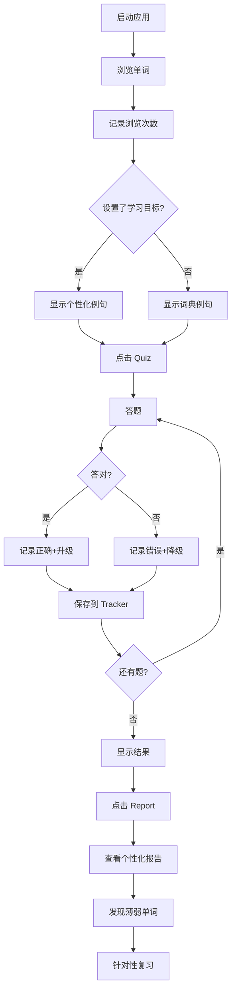

# Word Recite v3.0 - 功能更新说明

## 🎉 新增功能总览

### 1. ✅ 个性化例句生成
**功能描述**：基于用户的学习目标，LLM 自动生成贴合场景的例句

#### 使用流程
```
1. 打开 Settings → Learning Goal
2. 输入你的学习目标
   例如：
   • "准备托福考试"
   • "提升商务英语能力" 
   • "阅读英文技术文档"
   • "日常生活交流"

3. 保存设置后，主界面的例句会根据你的目标生成
```

#### 示例对比

**通用例句**：
```
单词: algorithm
例句: The algorithm is very efficient.
```

**个性化例句（目标：阅读英文技术文档）**：
```
单词: algorithm
例句: This sorting algorithm reduces time complexity from O(n²) to O(n log n).
```

**个性化例句（目标：日常交流）**：
```
单词: algorithm  
例句: Social media uses algorithms to show you relevant content.
```

#### 技术实现
- LLM 模型：Qwen 2.5-72B
- API：SiliconFlow
- 降级策略：LLM 不可用时，显示词典例句
- 配置存储：`~/.word_recite/config.json`

---

### 2. ✅ 学习记录追踪系统
**功能描述**：自动记录用户刷过的单词、quiz 答题情况和错题

#### 追踪内容

##### 单词浏览记录
- 浏览次数统计
- 首次/最后浏览时间
- 最常浏览的单词排名

##### 测试记录
- 每个单词的测试次数
- 答对/答错次数
- 正确率计算

##### 错题记录
- 错误选项记录
- 正确答案记录
- 时间戳
- 错误模式分析

#### 数据结构
```json
{
  "word": "vocabulary",
  "first_seen": "2025-11-15T10:00:00",
  "last_seen": "2025-11-15T14:00:00",
  "view_count": 15,
  "quiz_attempts": 5,
  "correct_count": 3,
  "wrong_count": 2,
  "wrong_history": [
    {
      "time": "2025-11-15T12:00:00",
      "selected": "语法规则",
      "correct": "词汇；词汇量"
    }
  ]
}
```

#### 薄弱单词识别
系统自动识别"薄弱单词"：
- 条件：测试次数 ≥ 3 次 且 正确率 < 60%
- 用途：优先推荐复习，生成针对性学习建议

---

### 3. ✅ 个性化学习报告
**功能描述**：基于学习记录生成详细的分析报告

#### 报告内容

##### 📊 学习数据总览
```
• 累计学习单词：1,234 个
• 已浏览单词：980 个
• 已测试单词：456 个
• 测试总次数：1,890 次
• 总体正确率：76.5%
```

##### ⚠️ 需要重点关注的单词
```
1. algorithm
   测试 5 次，正确率 40%
   最近错误：选择了「运算法则」，正确答案是「算法」

2. architecture
   测试 4 次，正确率 50%
   最近错误：选择了「建筑物」，正确答案是「架构；体系结构」
```

##### 🔍 最近的错题
列出最近 5 个答错的单词及错误详情

##### 📖 学习最多的单词
展示浏览次数最多的 3 个单词

##### 💡 学习建议
基于正确率和薄弱单词数量，给出个性化建议：
- 正确率 ≥ 80%：鼓励学习更难的单词
- 正确率 60-80%：建议重点复习薄弱单词
- 正确率 < 60%：建议降低学习速度，巩固基础

#### 查看方式
- 点击底部导航栏的 **Report** 按钮
- 弹出独立的报告窗口
- 可滚动查看完整内容

---

### 4. ✅ Quiz UI 优化（Anthropic 风格）

#### 改进内容

##### 选项按钮
```css
改进前:
- 高度: 50px
- 圆角: 10px
- 单选框: 20px 圆形

改进后:
- 高度: 60px (更易点击)
- 圆角: 12px (更柔和)
- 单选框: 22px (更清晰)
- 内边距: 16px 20px (更舒适)
```

##### 单选框选中效果
**Anthropic 风格的边框加粗效果**：
- 未选中：2px 细边框
- 选中：6px 粗边框（而非填充圆点）
- 悬停：边框颜色变化

##### 进度条
```css
- 高度: 12px
- 边框: 1px solid
- 圆角: 6px
- 文字: 居中显示 "5 / 20"
```

##### 按钮比例
- 选项按钮占据更多垂直空间
- 间距更合理（12px）
- 整体视觉更平衡

---

### 5. ✅ 导航栏按钮优化
**改进**：移除按钮边框，纯文字点击

```css
改进前:
[Settings] 带边框的按钮

改进后:
Settings   纯文字，悬停时显示背景
```

---

## 🔧 技术架构

### 新增模块

#### 1. learning_tracker.py
```python
LearningTracker
├── track_word_view(word)           # 记录浏览
├── track_quiz_correct(word)        # 记录答对
├── track_quiz_wrong(word, ...)     # 记录答错
├── get_weak_words()                # 获取薄弱单词
├── get_recent_mistakes()           # 获取最近错题
├── get_statistics()                # 获取统计数据
└── generate_learning_report()      # 生成报告
```

#### 2. llm_generator.py (扩展)
```python
+ generate_personalized_example(word, definition, learning_goal)
  # 生成个性化例句
```

#### 3. report_window.py
```python
ReportWindow
└── 独立的学习报告展示窗口
```

### 数据持久化

#### 目录结构
```
~/.word_recite/data/
├── words/                    # 词汇表
├── cache/                    # 词典缓存
├── reviews/                  # 复习记录
│   └── reviews.json
└── tracker/                  # 学习追踪
    └── learning_records.json
```

#### 自动保存时机
- 浏览单词 → 立即保存浏览记录
- 答题后 → 立即保存测试记录
- 窗口关闭 → 保存所有未保存数据

---

## 🎯 完整学习流程



---

## 📊 功能对比

| 功能 | v1.0 | v2.0 | v3.0 (Current) |
|------|------|------|----------------|
| 单词浏览 | ✅ | ✅ | ✅ + 记录追踪 |
| 内置词汇 | ❌ | ✅ | ✅ |
| 例句显示 | ✅ 词典例句 | ✅ 词典例句 | ✅ 个性化例句 |
| Quiz 测试 | ❌ | ✅ | ✅ + 记录追踪 |
| 学习报告 | ❌ | ❌ | ✅ |
| 薄弱词识别 | ❌ | ❌ | ✅ |
| 错题分析 | ❌ | ❌ | ✅ |
| LLM 集成 | ❌ | ✅ Quiz选项 | ✅ 选项+例句 |

---

## 🎨 UI/UX 改进

### Anthropic 美学体现

#### 1. 克制的交互
- 纯文字导航按钮（无边框）
- 微妙的悬停效果
- 简洁的颜色方案

#### 2. 独特的单选框设计
```
传统设计: ○ 未选中 → ● 填充圆点
Anthropic: ○ 细边框 → ◯ 粗边框（6px）
```

#### 3. 视觉层次
- 卡片式布局
- 清晰的内容分组
- 渐变色头部

#### 4. 功能性优先
- 更大的点击区域（60px 高度）
- 清晰的状态反馈
- 合理的信息密度

---

## 🔮 工作原理详解

### 个性化例句生成

```python
# 用户设置学习目标
learning_goal = "准备托福考试"

# 系统构建 Prompt
prompt = f"""
请为以下英语单词生成1个例句。
单词：{word}
释义：{definition}
用户学习目标：{learning_goal}
要求：贴合用户的学习目标场景...
"""

# LLM 生成例句
example = llm.generate(prompt)

# 显示给用户
"The TOEFL test requires a strong vocabulary foundation."
```

### 薄弱单词识别

```python
def is_weak(self) -> bool:
    # 测试超过3次 且 正确率低于60%
    return self.quiz_attempts >= 3 and self.get_accuracy() < 60
```

### 学习报告生成

```python
1. 收集所有学习记录
2. 统计各项数据
3. 识别薄弱单词
4. 分析最近错题
5. 生成个性化建议
6. 格式化输出报告
```

---

## 🚀 下一步优化方向

### 1. LLM 增强的错题分析
- 分析为什么选错
- 提供记忆技巧
- 生成对比说明

### 2. 智能复习推荐
- 基于错题记录推荐复习顺序
- 动态调整测试难度
- 优先测试薄弱单词

### 3. 学习曲线可视化
- 正确率趋势图
- 学习进度图
- 词汇量增长曲线

### 4. 导出功能
- 导出学习报告（PDF/TXT）
- 导出错题本
- 导出薄弱词汇表

---

## 📁 文件清单

### 新增文件
```
src/core/
├── learning_tracker.py       # 学习追踪系统
└── llm_generator.py          # LLM生成器（扩展）

src/ui/
└── report_window.py          # 学习报告窗口

data/
├── builtin_cet4.txt          # CET-4词汇
└── builtin_cet6.txt          # CET-6词汇

.env                          # API配置
FEATURES_v3.md               # 本文档
```

### 更新文件
```
main.py                       # 集成 LearningTracker
src/ui/main_window.py         # 个性化例句、报告按钮
src/ui/settings_window_new.py # 学习目标设置
src/ui/quiz_window.py         # UI优化、记录追踪
src/ui/themes.py              # 导航栏样式优化
src/core/config.py            # 新增 learning_goal 配置
```

---

## 🎯 使用指南

### 第一次使用

1. **设置学习目标**
   ```
   Settings → Learning Goal
   输入：准备托福考试
   保存
   ```

2. **选择词汇表**
   ```
   Settings → Word Lists
   选择：CET-4 Words (Built-in)
   保存
   ```

3. **开始学习**
   ```
   主界面 → 点击 ▶ 播放
   观察个性化例句（贴合托福场景）
   ```

4. **测试掌握度**
   ```
   底部导航 → Quiz
   完成 20 题测试
   ```

5. **查看报告**
   ```
   底部导航 → Report
   查看薄弱单词和学习建议
   ```

### 日常使用建议

**早晨（10分钟）**
- 查看 Report，了解昨天的学习成果
- 浏览 10-20 个新单词

**碎片时间（5分钟）**
- 打开应用，自动播放
- 利用通勤/休息时间复习

**晚上（15分钟）**
- 进行 Quiz 测试
- 重点复习薄弱单词

**周末（30分钟）**
- 完整测试所有单词
- 导出学习报告
- 规划下周学习计划

---

## 🔒 数据安全

### 本地存储
- 所有数据存储在本地（`~/.word_recite/`）
- 不上传任何学习记录到云端
- 完全的隐私保护

### API 密钥安全
- 存储在 `.env` 文件
- 不提交到 Git 仓库
- 可随时更换

### 数据备份建议
```bash
# 备份所有学习数据
cp -r ~/.word_recite ~/word_recite_backup_$(date +%Y%m%d)

# 恢复数据
cp -r ~/word_recite_backup_20251115 ~/.word_recite
```

---

## 🐛 已知问题及解决方案

### 1. Settings 窗口崩溃
**原因**：QPropertyAnimation 在某些系统上不稳定
**解决**：已禁用卡片动画效果

### 2. LLM API 连接错误
**原因**：网络问题或 API Key 配置错误
**解决**：
- 检查 `.env` 文件配置
- 测试网络连接
- 降级到词典例句（不影响使用）

### 3. 例句生成较慢
**原因**：LLM API 调用需要时间
**优化方向**：
- 添加缓存机制
- 后台预生成
- 批量生成

---

## 💡 最佳实践

### 1. 设置清晰的学习目标
```
✅ 好的目标：
- "准备托福考试，重点是学术场景词汇"
- "提升职场商务英语，用于邮件和会议"
- "阅读计算机科学论文和技术文档"

❌ 不好的目标：
- "学英语"（太笼统）
- "背单词"（没有场景）
```

### 2. 定期查看学习报告
- 每周至少查看 1 次
- 关注薄弱单词趋势
- 根据建议调整学习策略

### 3. 重点攻克薄弱单词
- 优先复习报告中标记的薄弱单词
- 理解为什么答错（查看错题记录）
- 多次测试直到掌握

### 4. 保持学习节奏
- 每天学习比一次性大量学习更有效
- 利用艾宾浩斯曲线间隔复习
- 坚持 21 天养成习惯

---

## 🎉 成果展示

### 功能完成度

✅ **持久化悬浮** - 应用持续运行，保存位置  
✅ **内置词汇表** - CET-4/CET-6 预装  
✅ **Anthropic 美学** - 独特的 UI 设计  
✅ **个性化例句** - 基于学习目标生成  
✅ **学习追踪** - 全面的记录系统  
✅ **学习报告** - 数据分析和建议  
✅ **Quiz 优化** - 更好的交互体验  
✅ **LLM 集成** - 智能内容生成  

### 底部导航栏
```
[Settings] [Quiz] [Report] [→ Dark] [×]
    ↓        ↓       ↓         ↓      ↓
   设置     测试    报告    主题切换  关闭
```

---

**版本**: v3.0  
**更新时间**: 2025-11-15  
**核心改进**: 个性化学习 + 智能追踪 + 数据分析  

## 🌟 总结

Word Recite 从一个简单的单词展示工具，进化为一个**智能的、个性化的、数据驱动的**单词学习系统。通过 LLM 的加持和完善的学习追踪，让每个用户都能获得量身定制的学习体验。
