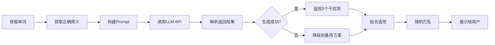

# LLM 集成说明文档

## 🤖 功能概述

集成了 Qwen 大语言模型，用于智能生成单词测试的高质量干扰项（错误选项），让测试更具挑战性和学习价值。

## 🔧 配置说明

### 1. 环境变量配置

在项目根目录创建 `.env` 文件：

```bash
# OpenAI Compatible API Configuration
OPENAI_API_KEY=sk-ebszrcmslswyatifseruyhpdvkqtyvlnyunufgbxawhbtvhf
OPENAI_BASE_URL=https://api.siliconflow.cn/v1
OPENAI_MODEL_NAME=Qwen/Qwen2.5-72B-Instruct
```

### 2. 配置说明

| 配置项 | 说明 | 示例值 |
|--------|------|--------|
| `OPENAI_API_KEY` | API密钥 | sk-xxx... |
| `OPENAI_BASE_URL` | API基础URL | https://api.siliconflow.cn/v1 |
| `OPENAI_MODEL_NAME` | 模型名称 | Qwen/Qwen2.5-72B-Instruct |

**注意**：使用的是 OpenAI 兼容的 API 格式，因此可以轻松切换到其他兼容的模型服务。

## 🎯 工作原理

### 1. LLM 生成流程



### 2. Prompt 设计

```python
请为以下英语单词的测试题生成3个干扰项（错误选项）。

单词：vocabulary
正确答案：词汇；词汇量
英文释义：a list or collection of words or phrases

要求：
1. 生成3个看似合理但错误的中文释义
2. 干扰项应该与正确答案有一定相似性（如相关领域、词性相同等）
3. 干扰项不能是正确答案的同义词
4. 每个干扰项应该简洁（不超过15个字）
5. 每行一个选项，不要编号

请直接输出3个干扰项，每行一个：
```

### 3. 示例输出

**输入**：
- 单词：vocabulary
- 正确答案：词汇；词汇量

**LLM 生成的干扰项**：
1. 语法规则
2. 发音技巧
3. 拼写方法

**最终选项（随机顺序）**：
- ○ 词汇；词汇量 ✓（正确答案）
- ○ 语法规则
- ○ 发音技巧
- ○ 拼写方法

## 📊 优势分析

### vs 传统随机选择

| 特性 | 传统方案 | LLM方案 |
|------|---------|---------|
| 干扰项质量 | 低（随机其他单词） | 高（语义相关） |
| 学习价值 | 低（容易排除） | 高（需要理解） |
| 挑战性 | 低 | 适中 |
| 生成速度 | 快 | 中等 |
| 成本 | 无 | API调用费用 |

### 关键优势

1. **语义相关性**
   - 生成的干扰项在语义上与正确答案相关
   - 例如：vocabulary 的干扰项会是"语法"、"发音"等英语学习相关词汇
   - 而不是完全无关的"苹果"、"汽车"等

2. **适当难度**
   - 不会太简单（显而易见的错误）
   - 不会太难（完全混淆）
   - 需要真正理解单词含义才能选对

3. **学习效果**
   - 通过对比相近概念，加深理解
   - 避免死记硬背
   - 培养语义辨析能力

## 🔄 降级策略

### 1. 降级触发条件

- LLM API 调用失败
- 网络超时
- 返回结果解析失败
- `.env` 配置缺失

### 2. 降级方案

```python
def _fallback_distractors(self) -> List[str]:
    """降级方案：从词库中随机选择"""
    distractors = []
    all_words = list(self.sr_manager.reviews.keys())
    random.shuffle(all_words)
    
    for word_text in all_words:
        if word_text == self.current_word.word:
            continue
        distractor = f"{word_text}的相关含义"
        distractors.append(distractor)
        if len(distractors) >= 3:
            break
    
    return distractors
```

### 3. 降级表现

- 仍然保证基本功能可用
- 选项质量略有下降但仍可接受
- 不影响用户体验连续性

## 🎨 UI 改进

### 1. 进度条优化

**改进前**：
- 高度太小（8px）
- 无边框，不明显
- 文字显示不清晰

**改进后**：
```python
self.progress_bar.setMinimumHeight(12)
self.progress_bar.setFormat("%v / %m")  # 显示 "5 / 20"
# 添加边框和圆角
border: 1px solid {theme['border']};
border-radius: 6px;
```

### 2. 选项按钮优化

**改进前**：
- 按钮高度不够
- 圆形单选框不够清晰
- 间距不合理

**改进后**：
```css
QRadioButton {
    padding: 14px 18px;
    min-height: 50px;
    border-radius: 10px;
}

QRadioButton::indicator {
    width: 20px;
    height: 20px;
    margin-right: 12px;
    /* 径向渐变实现更清晰的选中状态 */
}
```

### 3. 视觉效果对比

```
改进前:
┌────────────────────────┐
│ ○ 选项1                │  ← 高度不够，不易点击
└────────────────────────┘

改进后:
┌────────────────────────┐
│                        │
│  ●  选项1              │  ← 更大的点击区域
│                        │  ← 更清晰的单选框
└────────────────────────┘
```

## 📈 性能优化

### 1. 异步调用

```python
# 非阻塞的LLM调用
distractors = self.llm_generator.generate_distractors(
    word, correct_answer, definitions
)
```

### 2. 缓存机制（未来）

可以添加缓存避免重复调用：
```python
# 缓存已生成的干扰项
cache_key = f"{word}_{correct_answer}"
if cache_key in self.cache:
    return self.cache[cache_key]
```

### 3. 批量生成（未来）

```python
# 一次性生成多个单词的选项
distractors_batch = self.llm_generator.batch_generate(
    word_list, correct_answers
)
```

## 🔐 安全考虑

### 1. API Key 保护

- ✅ 使用 `.env` 文件存储敏感信息
- ✅ `.gitignore` 已配置忽略 `.env`
- ✅ 不在代码中硬编码 API Key

### 2. 错误处理

```python
try:
    self.llm_generator = LLMOptionGenerator()
except Exception as e:
    print(f"Failed to initialize LLM generator: {e}")
    self.llm_generator = None
```

### 3. 降级保护

即使 LLM 完全不可用，应用仍能正常工作。

## 💰 成本估算

### 基于 SiliconFlow 定价

假设：
- 每次测试 20 题
- 每题调用 1 次 API
- 每次调用约 100 tokens

**每日使用**：
- 测试 2 次 = 40 次 API 调用
- 月度调用 = 1200 次
- 预估成本 ≈ 极低（具体查看 SiliconFlow 定价）

**优化建议**：
- 添加本地缓存减少重复调用
- 批量生成降低调用次数
- 根据用户等级调整使用频率

## 🚀 未来改进

### 1. 多模型支持

```python
models = {
    "qwen": "Qwen/Qwen2.5-72B-Instruct",
    "gpt": "gpt-3.5-turbo",
    "claude": "claude-3-haiku"
}
```

### 2. 智能难度调整

```python
difficulty = self.get_user_level()
prompt += f"\n难度等级: {difficulty}"
```

### 3. 上下文学习

```python
# 基于用户历史错误生成针对性干扰项
weak_points = self.analyze_user_mistakes()
prompt += f"\n重点关注: {weak_points}"
```

### 4. A/B 测试

- 对比 LLM 生成 vs 传统方法的学习效果
- 优化 prompt 提升干扰项质量
- 测试不同模型的表现

## 📚 技术栈

- **OpenAI SDK**: 统一的 API 调用接口
- **python-dotenv**: 环境变量管理
- **Qwen 2.5**: 阿里开源大模型
- **SiliconFlow**: API 服务提供商

## 🎯 使用建议

### 开发环境
```bash
# 设置测试 API Key
echo "OPENAI_API_KEY=sk-test..." > .env
```

### 生产环境
```bash
# 使用正式 API Key
# 建议从环境变量或密钥管理服务读取
export OPENAI_API_KEY="sk-prod..."
```

### 调试模式
```python
# 查看 LLM 生成的原始输出
print(f"LLM response: {content}")
print(f"Parsed distractors: {distractors}")
```

## ✅ 测试清单

- [x] `.env` 文件配置正确
- [x] 依赖包已安装（openai, python-dotenv）
- [x] LLM 生成器初始化成功
- [x] API 调用成功返回结果
- [x] 降级方案正常工作
- [x] UI 进度条显示正确
- [x] 选项按钮样式优化
- [x] 答案反馈清晰可见

---

**更新时间**: 2025-11-15  
**版本**: 1.0  
**集成者**: Factory AI Assistant

## 🎉 总结

通过集成 LLM，我们将单词测试从简单的记忆检查提升为真正的理解测试。智能生成的干扰项不仅增加了挑战性，更重要的是帮助用户通过对比学习，深化对单词的理解。同时，完善的降级机制确保了系统的稳定性，让 AI 成为学习的助手而非障碍。
