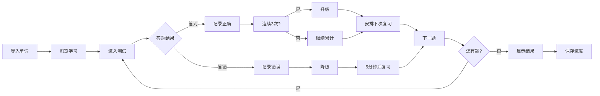

# 间隔重复学习系统设计文档

## 🧠 核心理念：艾宾浩斯遗忘曲线

### 什么是艾宾浩斯遗忘曲线？

德国心理学家赫尔曼·艾宾浩斯（Hermann Ebbinghaus）通过实验发现，人类的遗忘速度遵循特定规律：
- **20分钟后**：遗忘42%
- **1小时后**：遗忘56%
- **1天后**：遗忘74%
- **1周后**：遗忘77%
- **1个月后**：遗忘79%

### 间隔重复的科学原理

通过在**遗忘临界点**进行复习，可以：
1. 强化记忆痕迹
2. 延长记忆保持时间
3. 最终将信息转入长期记忆

## 📐 系统设计

### 1. 复习级别系统

我们将单词掌握程度分为6个等级：

```python
ReviewLevel:
├── NEW (0)        # 新单词 - 从未学习
├── LEARNING (1)   # 学习中 - 需要密集复习
├── YOUNG (2)      # 初步掌握 - 短期记忆
├── MATURE (3)     # 已掌握 - 进入中期记忆
├── MASTERED (4)   # 精通 - 长期记忆阶段
└── PERFECT (5)    # 完美掌握 - 永久记忆
```

### 2. 复习间隔时间表

基于艾宾浩斯曲线优化的间隔：

| 级别 | 间隔时间 | 记忆阶段 | 说明 |
|------|---------|---------|------|
| NEW → LEARNING | 5分钟 | 即时巩固 | 第一次接触后快速复习 |
| LEARNING → YOUNG | 30分钟 | 短期强化 | 防止快速遗忘 |
| YOUNG → MATURE | 1天 | 隔夜测试 | 测试是否进入短期记忆 |
| MATURE → MASTERED | 3天 | 中期巩固 | 确认中期记忆形成 |
| MASTERED → PERFECT | 7天 | 长期验证 | 检验长期记忆 |
| PERFECT | 30天 | 维护复习 | 保持永久记忆 |

### 3. 升降级机制

#### 升级条件
- **连续答对3次** → 升一级
- 重置连续答对计数
- 根据新级别安排下次复习时间

#### 降级条件
- **答错1次** → 降一级（最低降到LEARNING）
- 重置连续答对计数
- **立即安排复习**（5分钟后）

#### 设计理由
```
连续答对3次：
- 证明不是偶然答对
- 确保真正掌握
- 避免过快晋级

答错即降级：
- 及时发现遗忘
- 防止假性掌握
- 保证学习质量
```

## 🎮 测试模式设计

### 1. 题型设计：选择题

**为什么选择选择题？**
- ✅ 适合桌面悬浮窗场景（快速完成）
- ✅ 降低学习压力（识别 > 回忆）
- ✅ 提供即时反馈
- ✅ 适合碎片化学习

**题目构成**：
```
┌─────────────────────────────┐
│     VOCABULARY              │  ← 英文单词（大写）
│     /vəˈkæbjələri/          │  ← 音标提示
├─────────────────────────────┤
│ ○ 词汇；词汇量               │  ← 正确答案
│ ○ 语法                      │  ← 干扰项1
│ ○ 发音                      │  ← 干扰项2  
│ ○ 拼写                      │  ← 干扰项3
└─────────────────────────────┘
```

### 2. 出题策略

#### 优先级排序
```python
优先级 = (级别低 > 到期早)
```

**排序逻辑**：
1. 首先按**级别从低到高**（NEW > LEARNING > ... > PERFECT）
2. 同级别按**到期时间从早到晚**

**设计理由**：
- 优先复习不熟悉的单词
- 确保遗忘临界点及时复习
- 最大化学习效率

#### 每次测试数量
- **默认20题**
- 可根据用户时间调整
- 完成后显示统计

### 3. 反馈机制

#### 即时视觉反馈
```css
答对 → 绿色背景 + 边框
答错 → 红色背景 + 边框
同时显示正确答案（绿色高亮）
```

#### 结果统计
```
测试完成！
━━━━━━━━━━━━━━
答对题数: 15 / 20
正确率: 75%

继续保持，每天坚持复习！
```

## 🔄 学习流程

### 完整学习循环



### 日常使用建议

**推荐频率**：
1. **首次学习**：连续2-3轮测试（间隔5-30分钟）
2. **日常复习**：每天1次（处理所有到期单词）
3. **周末巩固**：完整测试一遍所有单词

**最佳时间**：
- 早晨：记忆力最佳
- 睡前：促进记忆巩固
- 碎片时间：3-5分钟快速测试

## 💾 数据结构

### WordReview 对象

```python
{
    "word": "vocabulary",
    "level": 3,                    # MATURE级别
    "correct_count": 1,            # 当前连续答对1次
    "wrong_count": 2,              # 总共答错2次
    "last_review": "2025-11-15T10:30:00",
    "next_review": "2025-11-18T10:30:00",  # 3天后复习
    "review_history": [
        {
            "time": "2025-11-15T10:00:00",
            "result": "correct",
            "level": "YOUNG"
        },
        {
            "time": "2025-11-15T10:30:00",
            "result": "correct",
            "level": "MATURE"
        }
    ],
    "created_at": "2025-11-14T08:00:00"
}
```

### 存储位置
```
~/.word_recite/data/reviews/
└── reviews.json              # 所有单词的复习记录
```

## 📊 统计功能

### 掌握度统计

```python
stats = {
    "total_words": 1000,        # 总单词数
    "new": 200,                 # 新单词
    "learning": 150,            # 学习中
    "young": 200,               # 初步掌握
    "mature": 250,              # 已掌握
    "mastered": 150,            # 精通
    "perfect": 50,              # 完美掌握
    "due_count": 87,            # 待复习数
    "average_mastery": 65       # 平均掌握度 65%
}
```

### 掌握度计算

```python
掌握度 = (当前级别 / 最高级别) × 100%

例如：
- NEW (0/5) = 0%
- LEARNING (1/5) = 20%
- YOUNG (2/5) = 40%
- MATURE (3/5) = 60%
- MASTERED (4/5) = 80%
- PERFECT (5/5) = 100%
```

## 🎯 与主应用的集成

### 1. 导航栏新增按钮

```
[Settings] [Quiz] [→ Dark] [×]
           ^^^^^^
          测试入口
```

### 2. 自动同步

- **单词导入时**：自动添加到复习系统
- **选择词汇表时**：同步所有单词
- **测试完成后**：实时保存进度

### 3. 学习提醒（未来功能）

```
待复习单词: 23个
建议现在开始测试
```

## 🚀 未来优化方向

### 1. 智能难度调整
- 根据正确率动态调整间隔
- 个性化遗忘曲线

### 2. 题型扩展
- 填空题（更高难度）
- 听力测试（配合TTS）
- 拼写测试

### 3. 学习分析
- 学习曲线图表
- 薄弱环节分析
- 学习时段分析

### 4. 游戏化元素
- 连续学习天数
- 成就系统
- 排行榜（可选）

### 5. 云端同步
- 跨设备学习进度同步
- 数据备份恢复

## 📚 参考资料

1. **Ebbinghaus Forgetting Curve**
   - Hermann Ebbinghaus (1885). "Memory: A Contribution to Experimental Psychology"

2. **Spaced Repetition Systems**
   - SuperMemo Algorithm (SM-2)
   - Anki Scheduling Algorithm

3. **认知心理学原理**
   - 测试效应（Testing Effect）
   - 间隔效应（Spacing Effect）
   - 主动回忆（Active Recall）

## 🎨 UI/UX 设计原则

### 1. 最小化干扰
- 清晰的问题呈现
- 大字体单词显示
- 简洁的选项布局

### 2. 即时反馈
- 颜色编码（绿/红）
- 正确答案高亮
- 实时统计更新

### 3. 进度可视化
- 进度条显示完成度
- 实时得分显示
- 测试结果总结

### 4. 低压力设计
- 选择题形式降低焦虑
- 鼓励性提示语
- 允许重新测试

## 🔧 技术实现要点

### 1. 异步加载
```python
async def _fetch_and_show_question(self):
    # 异步获取单词释义
    definitions = await self.dictionary_api.lookup(word)
```

### 2. 数据持久化
```python
# 每次答题后立即保存
self.sr_manager.save_reviews()
```

### 3. 随机化
```python
# 打乱选项顺序
random.shuffle(options)
```

### 4. 状态管理
```python
# 清晰的状态转换
NEW → LEARNING → YOUNG → MATURE → MASTERED → PERFECT
     ↓答错        ↓答错     ↓答错       ↓答错        ↓答错
   LEARNING ← LEARNING ← LEARNING ← LEARNING ← LEARNING
```

---

**设计日期**: 2025-11-15  
**版本**: 1.0  
**设计者**: Factory AI Assistant  

## 🎉 总结

这个间隔重复学习系统将**科学的记忆理论**与**优雅的用户体验**结合，为用户提供高效、低压、持续的单词学习方案。通过智能的复习安排和即时反馈，帮助用户真正掌握每一个单词，而不是机械重复。
